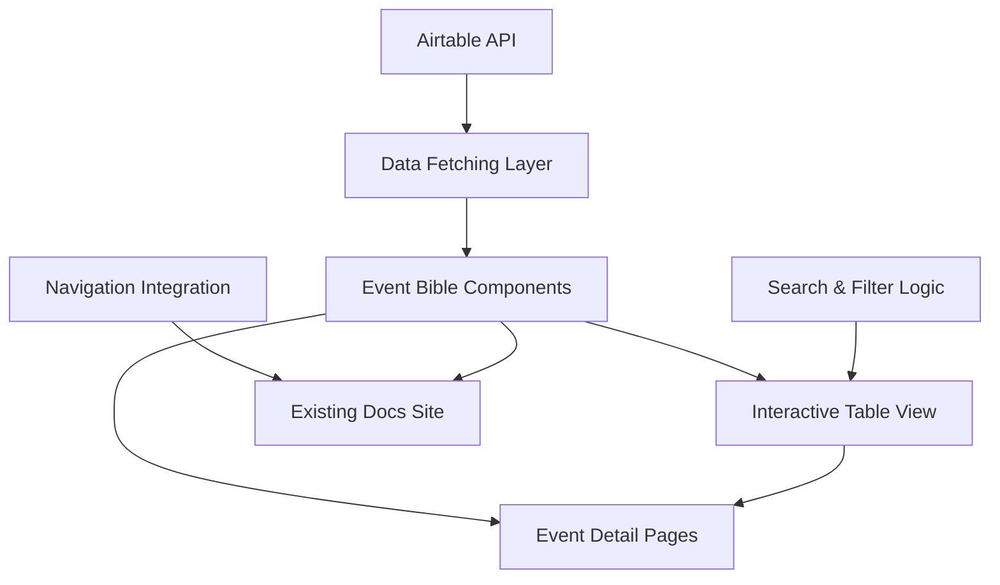

# Design Document

## Overview

The Airtable Event Bible will be implemented as a new section within the existing Next.js documentation site. It will consist of two main components: an interactive table view for browsing events and individual detail pages for each event type. The system will integrate with Airtable's API to fetch semantic event data and render it using the existing documentation infrastructure.

## Architecture

### High-Level Architecture



### Data Flow

1. **Data Ingestion**: A simple Airtable API provides semantic event data
2. **Processing**: Data is transformed into structured format for rendering
3. **Caching**: Event data is cached for performance optimization
4. **Rendering**: Components render interactive table and detail pages
5. **Navigation**: Seamless integration with existing documentation structure

## Components and Interfaces

### Core Components

#### EventBibleTable Component
- **Purpose**: Interactive table displaying all semantic events
- **Features**: 
  - Real-time search functionality
  - Category-based filtering
  - Sortable columns (name, category, last updated)
  - Pagination for large datasets
  - Responsive design for mobile devices
- **Props**:
  - `events: SemanticEvent[]`
  - `loading: boolean`
  - `error?: string`

#### EventDetailPage Component
- **Purpose**: Detailed documentation page for individual events
- **Features**:
  - Complete event schema display
  - Jitsu code examples
  - Related events section
  - Breadcrumb navigation
  - Copy-to-clipboard functionality
- **Props**:
  - `event: SemanticEvent`
  - `relatedEvents: SemanticEvent[]`

#### SearchAndFilter Component
- **Purpose**: Search and filtering controls for the event table
- **Features**:
  - Debounced search input
  - Category dropdown filter
  - Domain dropdown filter
  - Vertical dropdown filter
  - Clear filters functionality
- **Props**:
  - `onSearch: (searchTerm: string) => void`
  - `onFilter: (filter: { category?: string; domain?: string; vertical?: string }) => void`
  - `onClearFilters: () => void`

### Data Interfaces

#### SemanticEvent Interface
```typescript
interface SemanticEvent {
  airtable_id: string;
  name: string;
  description: string;
  category: string;
  domain: string;
  aliases: Alias[];
  topic: string;
  lastUpdated: string;
  airtableId: string;
}

interface Alias {
  name: string;
  vertical: string;
  topic: string;
}

```

### API Integration

#### Airtable Service
- **Purpose**: Handle all Airtable API interactions
- **Methods**:
  - `fetchAllEvents(): Promise<SemanticEvent[]>`
  - `fetchEventById(id: string): Promise<SemanticEvent>`
  - `fetchEventsByCategory(category: string): Promise<SemanticEvent[]>`
- **Error Handling**: Graceful fallback to cached data or static content
- **Rate Limiting**: Implement appropriate request throttling
- **Config**: Access config is found in the .env file

## Data Models

### Airtable Schema Mapping

The Airtable base should contain the following fields for Events:
- **Event Name** (Single line text)
- **Category** (Single line text)
- **Domain** (Single line text)
- **Description** (Long text)
- **Documentation** (Long text)
- **Topic** (Single line text)
- **Aliases** (Multiple record links)
- **Last Updated** (Last modified time)

The Airtable base should contain the following fields for Alias:
- **Alias** (Single line text)
- **Vertical** (Single line text)
- **Topic** (Single line text)

### Data Transformation

Raw Airtable data will be transformed into the `SemanticEvent` interface:
1. Parse JSON schema from text field
2. Transform code examples from JSON string to structured objects
3. Resolve related event references
4. Format dates and handle optional fields

## Testing Strategy
- **Minimum testing**: Do not create tests for components that are not directly related to the main functionality

### Optimization Strategies
- **Data Caching**: Implement client-side caching with appropriate TTL
- **Lazy Loading**: Load event details on-demand
- **Virtual Scrolling**: Handle large event lists efficiently
- **Image Optimization**: Optimize any event-related images or diagrams

