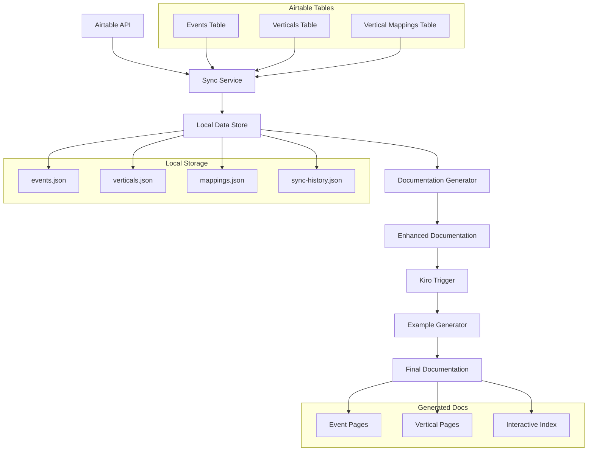

# Design Document

## Overview

The Event Bible Sync feature creates an automated pipeline to synchronize semantic event data from Airtable with local documentation, then enhance it with comprehensive examples and implementation details. The system consists of three main components: an Airtable sync service, a documentation generator, and a Kiro trigger for automated enhancement.

The feature integrates with the existing Next.js documentation site structure, extending the current Event Bible section with dynamic, data-driven content while maintaining the existing navigation and styling patterns.

## Architecture

### High-Level Architecture



### Data Flow

1. **Manual Sync Trigger**: Administrator runs sync command
2. **Airtable Data Fetch**: System retrieves data from three tables
3. **Data Validation**: Validates structure and handles errors
4. **Local Storage Update**: Updates JSON files with new data
5. **Documentation Generation**: Creates/updates .mdoc files
6. **Kiro Trigger Activation**: Automatically enhances documentation
7. **Example Generation**: Creates realistic implementation examples
8. **Final Output**: Complete interactive documentation

## Components and Interfaces

### 1. Airtable Sync Service

**Location**: `cxs/tools/event_bible/sync_service.py`

```python
class AirtableSyncService:
    def __init__(self, api_key: str, base_id: str):
        self.api_key = api_key
        self.base_id = base_id
        self.client = AirtableClient(api_key)
    
    async def sync_all_tables(self) -> SyncResult:
        """Sync all three Airtable tables"""
        
    async def fetch_events(self) -> List[EventRecord]:
        """Fetch events from Events table"""
        
    async def fetch_verticals(self) -> List[VerticalRecord]:
        """Fetch verticals from Verticals table"""
        
    async def fetch_mappings(self) -> List[MappingRecord]:
        """Fetch vertical mappings from Mappings table"""
```

**Configuration**: Environment variables and config file
```python
# .env or config
AIRTABLE_API_KEY=your_api_key
AIRTABLE_BASE_ID=your_base_id
EVENTS_TABLE_ID=table_id_1
VERTICALS_TABLE_ID=table_id_2
MAPPINGS_TABLE_ID=table_id_3
```

### 2. Data Models

**Location**: `cxs/tools/event_bible/models.py`

```python
from pydantic import BaseModel
from typing import List, Optional, Dict, Any
from datetime import datetime

class EventRecord(BaseModel):
    id: str
    name: str
    description: str
    classification: str
    category: str
    properties: Dict[str, Any]
    created_time: datetime
    modified_time: datetime

class VerticalRecord(BaseModel):
    id: str
    name: str
    description: str
    icon: str
    color: str
    created_time: datetime

class MappingRecord(BaseModel):
    id: str
    event_id: str
    vertical_id: str
    vertical_event_name: str
    vertical_description: Optional[str]
    importance: int
    topic: str
    additional_properties: Dict[str, Any]
    created_time: datetime

class SyncResult(BaseModel):
    success: bool
    events_synced: int
    verticals_synced: int
    mappings_synced: int
    errors: List[str]
    timestamp: datetime
```

### 3. Documentation Generator

**Location**: `cxs/tools/event_bible/doc_generator.py`

```python
class DocumentationGenerator:
    def __init__(self, data_dir: str, docs_dir: str):
        self.data_dir = Path(data_dir)
        self.docs_dir = Path(docs_dir)
    
    def generate_all_documentation(self) -> None:
        """Generate all documentation files"""
        
    def generate_event_pages(self, events: List[EventRecord]) -> None:
        """Generate individual event documentation pages"""
        
    def generate_vertical_pages(self, verticals: List[VerticalRecord], mappings: List[MappingRecord]) -> None:
        """Generate vertical-specific event pages"""
        
    def generate_interactive_index(self) -> None:
        """Generate the main interactive index page"""
        
    def update_navigation_config(self) -> None:
        """Update navigation configuration with new pages"""
```

### 4. CLI Interface

**Location**: `cxs/tools/event_bible/cli.py`

```python
import click
from .sync_service import AirtableSyncService
from .doc_generator import DocumentationGenerator

@click.group()
def event_bible():
    """Event Bible management commands"""
    pass

@event_bible.command()
@click.option('--dry-run', is_flag=True, help='Show what would be synced without making changes')
def sync(dry_run: bool):
    """Sync Event Bible data from Airtable"""
    
@event_bible.command()
def generate_docs():
    """Generate documentation from synced data"""
    
@event_bible.command()
def status():
    """Show sync status and last update information"""
```

### 5. Kiro Hook Integration

**Location**: `.kiro/hooks/event-bible-enhancement.md`

```yaml
---
name: Event Bible Documentation Enhancement
description: Automatically enhance Event Bible documentation after sync
trigger: file_change
pattern: "data/event-bible/*.json"
---

# Event Bible Enhancement Hook

This hook automatically runs after Event Bible data is synced to enhance the documentation with examples and detailed implementation guidance.

## Trigger Conditions
- Any JSON file in `data/event-bible/` is modified
- Sync operation completes successfully

## Enhancement Tasks
1. Generate realistic example payloads for each event
2. Create implementation snippets in multiple formats
3. Add schema validation examples
4. Generate vertical-specific variations
```

## Data Models

### Airtable Schema Mapping

**Events Table Fields**:
- `Name` (Single line text) → `name`
- `Description` (Long text) → `description`
- `Classification` (Single select) → `classification`
- `Importance` (Number) → `importance`
- `Category` (Single select) → `category`
- `RootCategory` (Single select) → `category`

**Verticals Table Fields**:
- `Name` (Single line text) → `name`
- `Description` (Long text) → `description`
- `Icon` (Single line text) → `icon`
- `Color` (Single line text) → `color`

**Mappings Table Fields**:
- `Event` (Link to Events) → `event_id`
- `Vertical` (Link to Verticals) → `vertical_id`
- `Vertical Event Name` (Single line text) → `vertical_event_name`
- `Vertical Description` (Long text) → `vertical_description`
- `Additional Properties` (Long text, JSON) → `additional_properties`
- `Topic Slug` (Single line text) → `a dot separated signature of the event like domain.category.sub_category.event`
- `Importance` (Number) → `1-5 importance level`

### Local Data Structure

```
data/
└── event-bible/
    ├── events.json
    ├── verticals.json
    ├── mappings.json
    ├── sync-history.json
    └── generated/
        ├── examples/
        │   ├── order-completed.json
        │   ├── product-viewed.json
        │   └── ...
        └── schemas/
            ├── order-completed-schema.json
            └── ...
```

### Generated Documentation Structure

```
docs/app/docs/semantic-events/bible/
├── index.mdoc (updated)
├── interactive/
│   ├── index.mdoc (new interactive index)
│   ├── events/
│   │   ├── order-completed.mdoc
│   │   ├── product-viewed.mdoc
│   │   └── ...
│   └── verticals/
│       ├── hospitality.mdoc
│       ├── ecommerce.mdoc
│       └── ...
```

## Error Handling

### API Error Handling

```python
class AirtableError(Exception):
    """Base exception for Airtable operations"""
    pass

class RateLimitError(AirtableError):
    """Raised when API rate limit is exceeded"""
    pass

class AuthenticationError(AirtableError):
    """Raised when API authentication fails"""
    pass

# Retry logic with exponential backoff
@retry(
    stop=stop_after_attempt(3),
    wait=wait_exponential(multiplier=1, min=4, max=10),
    retry=retry_if_exception_type(RateLimitError)
)
async def fetch_with_retry(self, endpoint: str) -> Dict[str, Any]:
    """Fetch data with automatic retry on rate limits"""
```

### Data Validation

```python
def validate_sync_data(events: List[EventRecord], verticals: List[VerticalRecord], mappings: List[MappingRecord]) -> List[str]:
    """Validate synced data for consistency and completeness"""
    errors = []
    
    # Check for orphaned mappings
    event_ids = {e.id for e in events}
    vertical_ids = {v.id for v in verticals}
    
    for mapping in mappings:
        if mapping.event_id not in event_ids:
            errors.append(f"Mapping references non-existent event: {mapping.event_id}")
        if mapping.vertical_id not in vertical_ids:
            errors.append(f"Mapping references non-existent vertical: {mapping.vertical_id}")
    
    return errors
```

### File System Error Handling

```python
def safe_write_json(file_path: Path, data: Any) -> bool:
    """Safely write JSON data with backup and rollback"""
    backup_path = file_path.with_suffix('.json.backup')
    
    try:
        # Create backup if file exists
        if file_path.exists():
            shutil.copy2(file_path, backup_path)
        
        # Write new data
        with open(file_path, 'w') as f:
            json.dump(data, f, indent=2, default=str)
        
        # Remove backup on success
        if backup_path.exists():
            backup_path.unlink()
        
        return True
    except Exception as e:
        # Restore backup on failure
        if backup_path.exists():
            shutil.copy2(backup_path, file_path)
            backup_path.unlink()
        raise e
```

## Testing Strategy

### Unit Tests

**Location**: `tests/tools/event_bible/`

```python
# test_sync_service.py
class TestAirtableSyncService:
    @pytest.fixture
    def mock_airtable_response(self):
        return {
            "records": [
                {
                    "id": "rec123",
                    "fields": {
                        "Name": "Order Completed",
                        "Description": "When a user completes an order",
                        "Classification": "Commerce",
                        "Importance": 3
                    }
                }
            ]
        }
    
    async def test_fetch_events_success(self, mock_airtable_response):
        # Test successful event fetching
        
    async def test_fetch_events_rate_limit(self):
        # Test rate limit handling
        
    async def test_fetch_events_auth_error(self):
        # Test authentication error handling

# test_doc_generator.py
class TestDocumentationGenerator:
    def test_generate_event_page(self):
        # Test event page generation
        
    def test_generate_vertical_page(self):
        # Test vertical page generation
        
    def test_update_navigation_config(self):
        # Test navigation config updates
```

### Integration Tests

```python
# test_integration.py
class TestEventBibleIntegration:
    async def test_full_sync_workflow(self):
        # Test complete sync workflow
        
    def test_documentation_generation_workflow(self):
        # Test documentation generation
        
    def test_kiro_hook_integration(self):
        # Test Kiro hook triggering
```

### End-to-End Tests

```python
# test_e2e.py
class TestEventBibleE2E:
    def test_sync_and_generate_docs(self):
        # Test full pipeline from sync to documentation
        
    def test_navigation_integration(self):
        # Test that generated docs integrate with navigation
        
    def test_example_generation(self):
        # Test that examples are generated correctly
```

## Implementation Phases

### Phase 1: Core Sync Infrastructure
- Airtable API client
- Data models and validation
- Basic sync service
- CLI interface
- Error handling and logging

### Phase 2: Documentation Generation
- Documentation generator
- Template system for .mdoc files
- Navigation config updates
- File system management

### Phase 3: Enhancement and Examples
- Kiro hook integration
- Example generation system
- Schema validation examples
- Interactive features

### Phase 4: Polish and Optimization
- Performance optimization
- Advanced error recovery
- Comprehensive testing
- Documentation and user guides